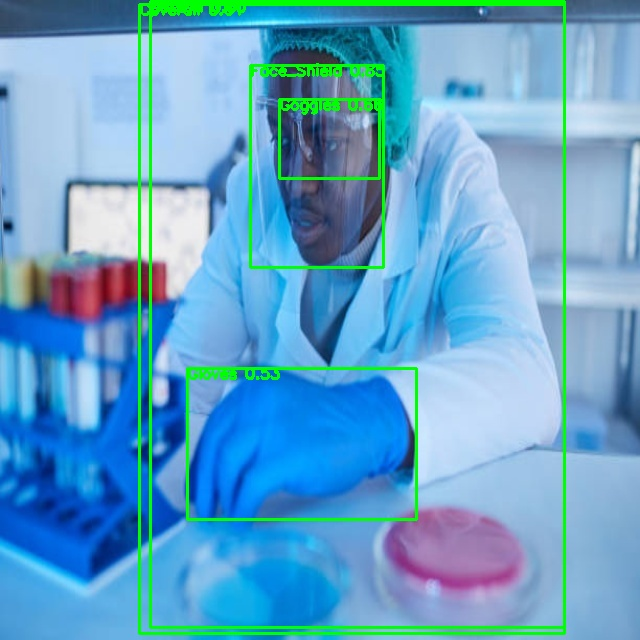

# 🛡️ PPE Detection using YOLOv8

This project leverages YOLOv8 for detecting Personal Protective Equipment (PPE) like helmets, gloves, vests, masks, goggles, etc., from images or video feeds. It's ideal for workplace safety compliance and monitoring.

---

## 📁 Project Structure

```
PPE_DETECTION/
├── dataset/                  # Labeled dataset (train/test/valid)
│   ├── train/
│   ├── test/
│   ├── valid/
│   └── data.yaml             # Class and path definitions
├── runs/                     # YOLOv8 training/prediction outputs
├── .gitignore                # Files/folders excluded from Git
├── PPE.ipynb                 # Main notebook: training & inference
├── Labelling.ipynb           # Optional notebook for annotation
├── requirements.txt          # Dependencies list
├── yolo*.pt                  # Trained YOLOv8 model weights
├── test*.jpg                 # Test images
└── predictions_output.jpg    # Sample prediction output
```

---

## ⚙️ Setup Instructions

1. **Clone the Repository**

```bash
git clone https://github.com/yourusername/PPE_DETECTION.git
cd PPE_DETECTION
```

2. **(Optional) Create a Virtual Environment**

```bash
python -m venv ppe_env
# Activate:
# Windows:
ppe_env\Scripts\activate
# Linux/Mac:
source ppe_env/bin/activate
```

3. **Install Required Packages**

```bash
pip install -r requirements.txt
```

---

## 🚀 How to Run

- **Training**

Edit `data.yaml` and run the training command in your notebook or terminal:

```python
!yolo task=detect mode=train model=yolov8n.pt data=dataset/data.yaml epochs=50 imgsz=640
```

- **Inference**

Use a trained model to detect PPE:

```python
!yolo task=detect mode=predict model=runs/detect/train/weights/best.pt source=test.jpg
```

- **Results**

Check `runs/detect/` for predictions and training logs.

---

## ✅ Requirements

- Python 3.8+
- [Ultralytics YOLOv8](https://github.com/ultralytics/ultralytics)
- OpenCV, matplotlib, numpy, etc.

---

## 🧹 Notes

- `.gitignore` excludes `.ipynb_checkpoints`, `runs/`, `*.pt`, test images, and virtual environments.
- Clean up unnecessary `.pt` or checkpoint files before pushing to Git.

---

## 📌 TODO

- [ ] Add real-time webcam inference
- [ ] Integrate Streamlit dashboard
- [ ] Add PPE compliance summary output

---

## 📷 Sample Output



---

## 📬 Contact

For questions or contributions, please open an issue or reach out me.
